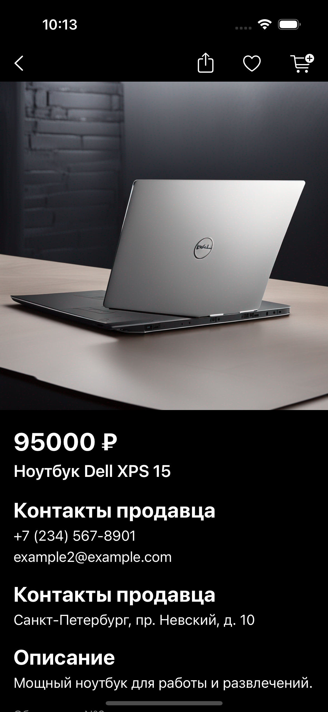

# Avito trainee assignment

Вступительное задание в Avito

## Описание

Приложение состоит из двух экранов:
- Список товаров
- Подробная информация о товаре

Также приложение имеет Unit тесты

## Экран со списком товаров

- Отображение контента: список товаров  
- Отображение ошибки: кнопка для повторной загрузки  
- Состояние загрузки: индикатор загрузки

## Экран с детальной инфоормаций о товара

- Отображение контента: информация о товаре  
- Отображение ошибки: кнопка для повторной загрузки  
- Состояние загрузки: индикатор загрузки

## Скриншоты

### Состояние загрузки

Товаров            |  Информация о товаре
:-------------------------:|:-------------------------:
  |  

### Отображение ошибки

Товаров            |  Информация о товаре
:-------------------------:|:-------------------------:
  |  

### Экран со списком товаров

Светлая тема             |  Темная тема
:-------------------------:|:-------------------------:
  |  

### Экран с детальной инфоормацией о товара

Светлая тема            |  Темная тема
:-------------------------:|:-------------------------:
  |  

## Установка и запуск

1. Склонируйте репозиторий с GitHub: https://github.com/uevuu/avito-trainee-assignment
2. Откройте проект в Xcode
3. Запустите симулятор
4. Нажмите кнопку "Run" или  нажмите Command-R в Xcode для сборки и запуска приложения
5. Для запуска Unit тестов: Product ▸ Test и Command-U
